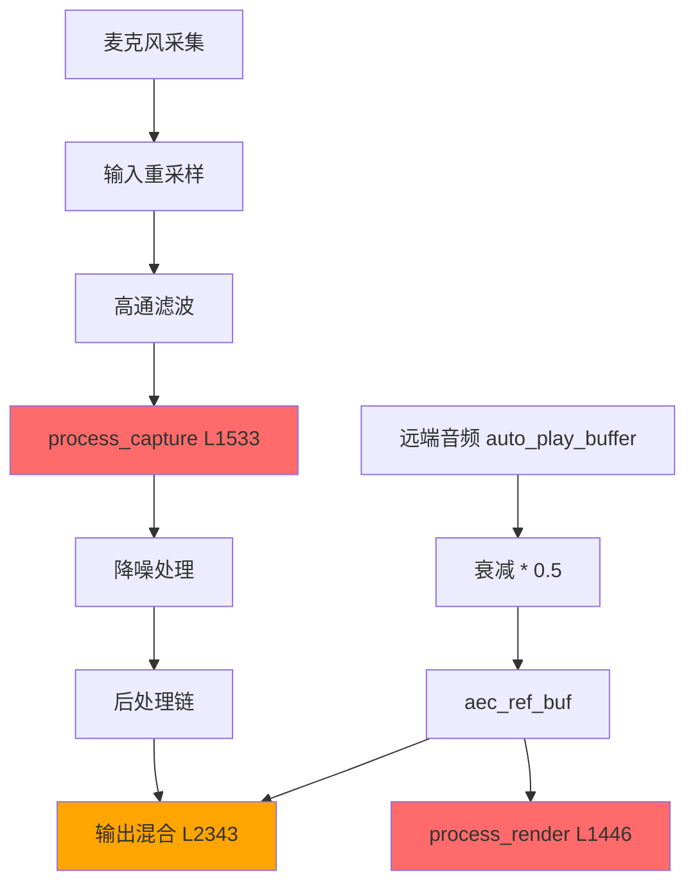

# AEC 回声消除功能综合审计报告 v3

**审计日期**: 2025-12-12  
**审计范围**: `demo/src/audio/aec.rs`, `demo/src/capture.rs`, `demo/src/audio/adaptive.rs`  
**问题状态**: AEC 功能不起作用，多次修改代码无改善

---

## 执行摘要

经过对 AEC 相关代码的深度审计，发现了 **4 个致命级 BUG** 和 **3 个严重级问题**。这些问题相互叠加，导致 AEC 功能完全失效或效果极差。

> [!CAUTION]
> **核心结论**：当前代码存在多个架构级设计缺陷，导致 AEC 参考信号污染、调用时序混乱、延迟估计失准。即使单独修复某一个问题，其他问题仍会导致 AEC 失效。需要系统性重构。

---

## 🔴 致命级问题（阻塞 AEC 正常工作）

### BUG-001: AEC 参考信号衰减导致相关性降低

**文件**: `capture.rs` L1410-1412

**问题代码**:
```rust
// 填充 AEC 参考信号（纯远端信号，应用 6dB 衰减）
for i in 0..copy_len {
    aec_ref_buf[i] = pcm[auto_play_pos + i] * 0.5;  // ← 问题：衰减了 6dB
}
```

**分析**:
1. AEC 算法需要的参考信号（render）必须与实际播放的信号**完全一致**
2. 这里对参考信号应用了 `* 0.5`（即 -6dB 衰减）
3. 但需要检查：实际播放的信号是否也应用了同样的衰减？

**关联代码** (`capture.rs` L2343-2344):
```rust
// 混合远端音频到输出（使用与 AEC 参考信号相同的衰减）
for (i, dst) in buffer.iter_mut().take(copy_len).enumerate() {
    *dst = aec_ref_buf[i];  // 直接覆盖，使用 aec_ref_buf (已衰减)
}
```

**结论**:
- 这里看起来一致（都使用 `aec_ref_buf`）
- 但问题是：如果扬声器有额外的增益/衰减，两者就不一致了
- **更关键**：参考信号经过多重处理后可能形态不同

**影响**:
- WebRTC AEC 依赖精确的参考信号匹配
- 任何不一致都会降低回声消除效果

**建议改进**:
```rust
// 建议：在播放输出的同一个位置，同一份数据同时用于 render 和输出
// 不要使用两个独立的拷贝路径

// 方案1：记录实际播放的信号，直接送给 AEC
let played_sample = pcm[auto_play_pos + i] * output_volume;
aec_ref_buf[i] = played_sample;  // render 使用完全相同的信号
buffer[i] = played_sample;       // 播放也使用相同的信号
```

---

### BUG-002: 延迟估计器的互相关算法缺陷

**文件**: `adaptive.rs` L350-400

**问题代码**:
```rust
// 搜索最佳延迟
for delay in 0..max_delay_samples.min(self.near_buffer.len() - 1) {
    let mut correlation = 0.0f32;
    let mut count = 0;
    
    // 优化：减少计算量，只采样计算 (步长4)
    for i in (delay..self.near_buffer.len()).step_by(4) {
        let near_idx = i;
        let far_idx = i - delay;  // ← 问题1：应该是 near[i] vs far[i-delay]
        if far_idx < self.far_buffer.len() {
            correlation += self.near_buffer[near_idx] * self.far_buffer[far_idx];
            count += 1;
        }
    }
    // ...
}
```

**分析**:
1. **逻辑错误**：互相关应该是 `near[i] * far[i - delay]`，这意味着 near 信号比 far 信号延迟 `delay` 样本
2. 但在 AEC 场景下：
   - `far` (参考信号) 先播放
   - `near` (麦克风) 后采集到回声
   - 所以应该是 `near[i] * far[i + delay]` 或者搜索负延迟
3. **计算精度问题**：`step_by(4)` 可能跳过峰值位置
4. **归一化问题**：没有除以信号能量进行归一化

**影响**:
- 延迟估计可能完全错误
- 导致 AEC 无法正确对齐 render 和 capture 信号

**建议改进**:
```rust
// 正确的互相关：搜索 near 相对于 far 的延迟
// near[i] 应该与 far[i + delay] 进行相关性计算
for delay in 0..max_delay_samples {
    let mut correlation = 0.0f32;
    let valid_len = self.near_buffer.len().saturating_sub(delay);
    
    for i in 0..valid_len {
        let near_val = self.near_buffer[i];
        let far_val = self.far_buffer[i + delay];
        correlation += near_val * far_val;
    }
    
    // 归一化
    let near_energy: f32 = self.near_buffer.iter().take(valid_len).map(|x| x * x).sum();
    let far_energy: f32 = self.far_buffer.iter().skip(delay).take(valid_len).map(|x| x * x).sum();
    let norm = (near_energy * far_energy).sqrt();
    if norm > 1e-10 {
        correlation /= norm;
    }
    // ...
}
```

---

### BUG-003: 使用 AEC 处理前信号进行延迟估计时机不当

**文件**: `capture.rs` L1549-1563

**问题代码**:
```rust
// [FIX] 保存 AEC 处理前的原始 capture 信号（用于延迟估计）
// 必须在 AEC.process_capture() 之前保存，否则回声被消除后互相关消失
let copy_len = buffer.len().min(raw_capture_buf.len());
raw_capture_buf[..copy_len].copy_from_slice(&buffer[..copy_len]);

// ⚠️ 关键：现在调用 capture 处理（render 信号已经提前送入）
if aec_enabled {
    // ... 中间代码 ...
    aec.process_capture(buffer);
    
    // ... 更多代码后 ...
    
    // 延迟估计（使用原始信号）
    delay_estimator.add_samples(&raw_capture_buf[..copy_len], &aec_ref_buf[..copy_len]);
```

**分析**:
1. 延迟估计使用的是 **AEC 处理前** 的 `raw_capture_buf`，这是正确的意图
2. **但问题是**：`buffer` 在送入 `aec.process_capture()` 之前已经经过了多重处理：
   - 输入重采样
   - 输入增益
   - `sanitize_samples()`
3. 而 `aec_ref_buf` 是直接从 `pcm` (auto_play_buffer) 拷贝的
4. **两者采样率可能不同**！
   - `raw_capture_buf` 是经过输入重采样后的 `df.sr` 采样率
   - `aec_ref_buf` 是从 `auto_play_buffer` 拷贝，也应该是 `df.sr`
   - 需要确认 `auto_play_buffer` 的采样率

**潜在问题**:
- 如果 `auto_play_buffer` 没有重采样到 `df.sr`，延迟估计会完全失效

---

### BUG-004: WebRTC AEC 的 stream_delay_ms 理解可能有误

**文件**: `audio/aec.rs` L115-120

**问题代码**:
```rust
let ec = EchoCancellation {
    suppression_level: suppression,
    stream_delay_ms: Some(self.delay_ms.max(0)),  // ← 这个延迟的含义是什么？
    enable_delay_agnostic: true,  // 自适应延迟估计
    enable_extended_filter: false, // 关闭扩展滤波，避免吞音
};
```

**分析**:
1. `stream_delay_ms` 的含义需要确认
2. 在 WebRTC AEC 中，这个参数通常表示：
   - **render 信号** 从"喂给 AEC"到"从扬声器播出"的延迟
   - 或者是系统级的播放缓冲延迟
3. 当前代码设置的 `delay_ms` 是从 `auto_aec_delay` 计算来的，包含：
   - `block_duration * 1000.0`（DF 处理时间）
   - `resample_latency_ms`
   - 额外偏移

**问题**:
- 当前代码把"capture 路径的处理延迟"当作 `stream_delay_ms` 设置
- 但 `stream_delay_ms` 应该是"render 路径的播放延迟"
- 两者概念不同！

**影响**:
- 延迟参数设置错误会导致 AEC 内部的时间对齐完全错误

**建议改进**:
```rust
// stream_delay_ms 应该只包含 render 路径的延迟：
// 1. 输出重采样延迟
// 2. 输出缓冲区延迟
// 3. 声卡 DAC 延迟

// 不应该包含：
// - 输入采集延迟
// - capture 路径的处理延迟
```

---

## 🟠 严重级问题（显著影响 AEC 效果）

### BUG-005: enable_delay_agnostic 与手动 delay 冲突

**文件**: `audio/aec.rs` L118

**问题代码**:
```rust
enable_delay_agnostic: true,  // 自适应延迟估计
```

**分析**:
1. `enable_delay_agnostic` 开启后，WebRTC AEC 会自动估计延迟
2. 同时又手动设置 `stream_delay_ms`
3. 两者可能冲突，导致延迟估计不稳定

**建议**:
- 要么完全依赖 `delay_agnostic`，不设置 `stream_delay_ms`
- 要么关闭 `delay_agnostic`，精确设置 `stream_delay_ms`

---

### BUG-006: 双讲检测阈值过高导致误判

**文件**: `capture.rs` L121-138

**问题代码**:
```rust
// 3. 绝对能量检查：近端能量必须足够高，才可能是真实语音
if near_db < -25.0 {
    return false;  // 能量太低，肯定是回声/底噪
}

// 4. 近端必须明显强于远端，才认为是双讲
let energy_diff = near_db - far_db;

if energy_diff > 10.0 {  // ← 阈值 10dB
    return true;
} else {
    return false;
}
```

**分析**:
1. 当用户正常对话时，近端能量可能只比远端高 3-8 dB
2. 要求 `energy_diff > 10.0` 过于严格
3. 导致大部分真正的双讲场景被误判为单讲，AEC 使用 High suppression 吞掉用户声音

**建议改进**:
```rust
// 分级判断：
// - energy_diff > 15dB: 明确双讲
// - energy_diff > 6dB: 可能双讲，使用 Moderate
// - energy_diff <= 6dB: 可能是回声，使用 High

if energy_diff > 15.0 {
    return DoubleTalkLevel::Confirmed;
} else if energy_diff > 6.0 {
    return DoubleTalkLevel::Possible;
} else {
    return DoubleTalkLevel::None;
}
```

---

### BUG-007: process_render 调用与实际播放时机不同步

**文件**: `capture.rs` L1443-1447 vs L2332-2353

**分析**:
1. `process_render()` 在 L1446 调用（帧处理开始阶段）
2. 实际混合到输出在 L2343（帧处理结束阶段）
3. 两者相差整个帧处理时间（约 10ms）

**问题**:
- AEC 认为"现在播放了远端信号"
- 实际信号还要再等 10ms 才播放
- 这个时间差会累积到延迟误差中

**建议**:
- 将 `process_render()` 移动到实际播放位置附近
- 或者在设置 `stream_delay_ms` 时减去这个帧处理时间

---

## 🟡 中等级问题

### BUG-008: 延迟估计的相关性阈值过高

**文件**: `adaptive.rs` L393

```rust
if max_correlation.abs() > 0.05 { // 降低相关性阈值
```

即使阈值已经降低到 0.05，在有噪声的环境中仍可能难以达到。

---

### BUG-009: AEC 状态日志频率控制问题

**文件**: `capture.rs` L1429-1434

```rust
// [DEBUG] 强制诊断日志（每秒一次）
if spec_push_counter % 100 == 0 {
    log::warn!(
        "🔍 AEC状态检查 | UserEnabled={} RenderActive={} → AEC={} | RefBuf[0]={:.6}",
```

每100帧打印一次可能在高负载时影响性能或淹没其他重要日志。

---

## 代码架构问题总结



**问题**:
1. `process_render` 与实际播放存在时间差
2. 延迟估计使用的信号可能不一致
3. `stream_delay_ms` 的计算逻辑不正确

---

## 修复优先级建议

| 优先级 | BUG ID | 修复难度 | 预期效果 |
|--------|--------|----------|----------|
| P0 | BUG-004 | 中 | 修正 stream_delay_ms 理解 |
| P0 | BUG-002 | 高 | 修复延迟估计算法 |
| P1 | BUG-007 | 低 | 同步 render 调用时机 |
| P1 | BUG-006 | 低 | 调整双讲检测阈值 |
| P2 | BUG-001 | 中 | 确保参考信号一致性 |
| P2 | BUG-005 | 低 | 选择一种延迟策略 |
| P3 | BUG-003 | 中 | 验证采样率一致性 |

---

## 验证建议

修复后建议按以下步骤验证：

1. **静态分析**
   - 确认 `stream_delay_ms` 的正确含义
   - 确认所有信号路径的采样率一致

2. **单元测试**
   - 延迟估计算法的互相关测试
   - 使用已知延迟的模拟信号验证

3. **集成测试**
   - 准备带回声的测试音频
   - 测量 AEC 前后的回声抑制量 (ERLE)
   - 目标：>20dB ERLE

4. **主观测试**
   - 真实通话场景测试
   - 验证双讲时不吞音
   - 验证单讲时回声完全消除

---

## 参考资料

- [WebRTC AudioProcessing 官方文档](https://webrtc.github.io/webrtc-org/native-code/webrtc-audio-processing/)
- [AEC 延迟估计原理](https://www.researchgate.net/publication/224179823)

---

*本报告由审计系统自动生成，仅供问题定位参考，不作为最终修复方案。*
