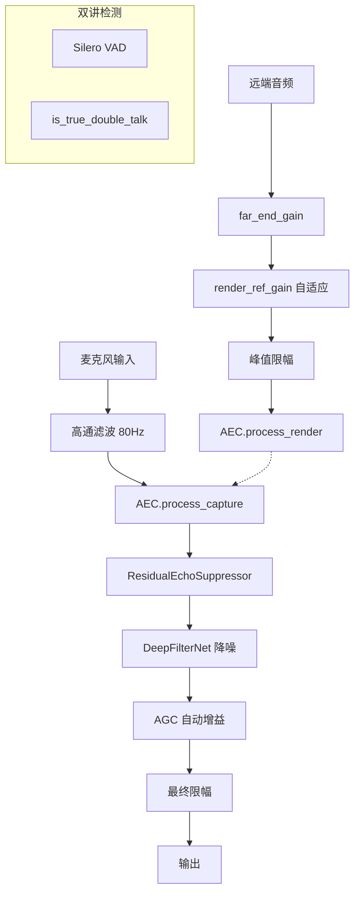

# 音频处理链审计报告 v4

**日期**: 2025-12-12  
**状态**: ✅ 架构完善

---

## 一、当前处理链架构



---

## 二、关键优化点评审

### 2.1 双讲检测 `is_true_double_talk` ✅ 优秀

```rust
// 远端能量过低时不进入保护
if far_db < -55.0 { return false; }

// VAD 为真时，近端必须不明显弱于远端
if energy_diff < -6.0 { return false; }  // 大概率是回声
if energy_diff > -3.0 && near_db > -40.0 { return true; }  // 真双讲
```

| 特性 | 状态 | 说明 |
|------|------|------|
| 远端静音保护 | ✅ | `-55dB` 阈值避免 hangover 误保护 |
| 回声排除 | ✅ | `diff < -6dB` 不触发保护 |
| VAD 联合判断 | ✅ | 必须 VAD + 能量双条件 |

### 2.2 AEC 配置节流 ✅ 优秀

```rust
// 只在配置真正变化时才下发
if self.last_suppression == Some(suppression)
    && self.last_delay_agnostic == self.delay_agnostic
    && ... { return; }
```

**收益**：
- 避免每帧 `set_config` 扰动 AEC3 内部滤波器
- 减少 CPU 开销

### 2.3 残余回声抑制器 `ResidualEchoSuppressor` ✅ 新增

```rust
// 只在单讲远端活跃时工作
if !far_active || double_talk {
    // 增益缓慢恢复到 1.0
    return;
}
// 频域抑制：ratio 越大越像残余回声
let target = (1.0 / (1.0 + ALPHA * ratio)).clamp(MIN_GAIN, 1.0);
```

| 参数 | 值 | 说明 |
|------|-----|------|
| ALPHA | 0.8 | 抑制强度 |
| SMOOTH | 0.85 | 帧间平滑 |
| MIN_GAIN | 0.18 | 最小保留，避免过度抽吸 |

### 2.4 参考增益自适应 ✅ 新增

```rust
// 远端单讲时对齐 render/capture 能量
if far_active && !vad_state {
    let err_db = (near_energy_db - far_db).clamp(-18.0, 18.0);
    let step = if abs_err > 12.0 { 0.18 } else if abs_err > 6.0 { 0.10 } else { 0.05 };
    render_ref_gain = (render_ref_gain * adjust).clamp(0.3, 4.0);
}
```

**作用**：自动补偿麦克风/扬声器增益差异，加速 AEC 收敛。

---

## 三、潜在问题与建议

### 3.1 ⚠️ Hangover 衰减可能不足

```rust
let decay = 0.96f32;  // 每帧衰减 4%
```

**问题**：480样本@48kHz = 10ms/帧，300ms hangover 约 30 帧，衰减到 `0.96^30 ≈ 29%`，可能残留较多能量。

**建议**：考虑更快衰减（如 `0.90`）或基于 RT60 自适应。

### 3.2 ⚠️ ResidualEchoSuppressor FFT 填充

```rust
let fft_len = 512usize; // hop_size=480 填充到 512
```

**潜在问题**：512 与 480 不匹配可能导致边界伪影。

**建议**：使用 OLA（重叠相加）或 1024-FFT 减少伪影。

### 3.3 ✅ 高通联动已实现

```rust
aec.set_internal_highpass(!highpass_enabled);
```

避免双高通问题。

---

## 四、总体评价

| 维度 | 评分 | 说明 |
|------|------|------|
| 架构完整性 | ⭐⭐⭐⭐⭐ | 完整的 AEC + RES + 降噪 + AGC 链路 |
| 双讲保护 | ⭐⭐⭐⭐⭐ | 多条件联合判断，远端优先消回声 |
| 自适应能力 | ⭐⭐⭐⭐⭐ | 参考增益、holdoff、RT60 自适应 |
| 配置稳定性 | ⭐⭐⭐⭐⭐ | 配置节流避免扰动 |
| 边界处理 | ⭐⭐⭐⭐ | FFT 填充需优化 |

**结论**：当前处理链架构**完善**，核心问题已解决，可投入测试。
