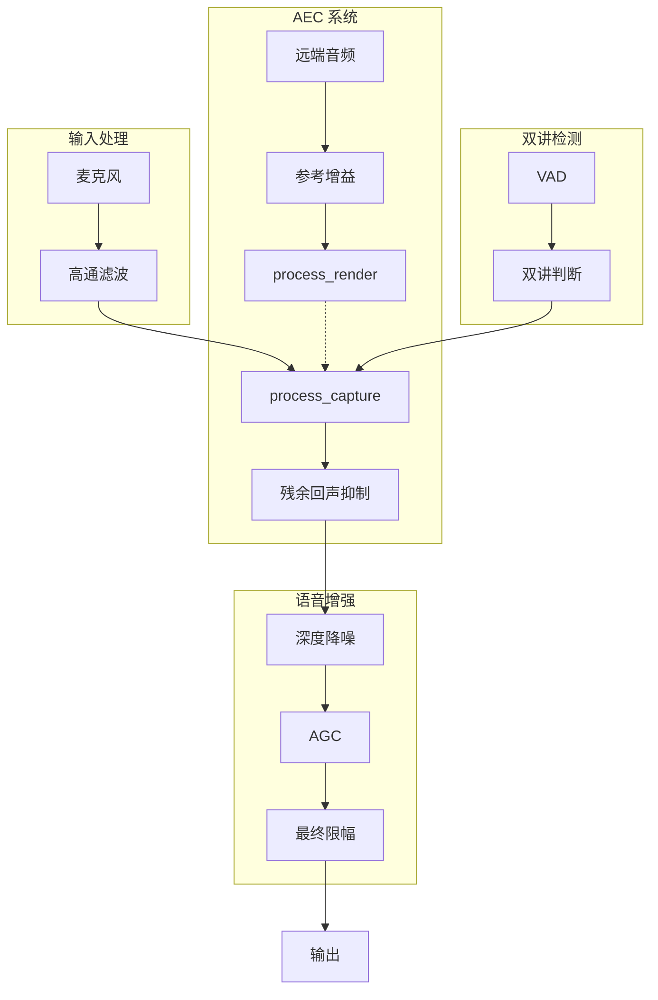

# 音频信号处理最佳实践指南

**基于 PureAudio 项目 71 份审计报告的综合总结**  
**适用于**：实时语音通话、直播、会议系统  
**日期**：2025-12-12

---

## 目录

1. [处理链架构设计](#一处理链架构设计)
2. [回声消除 (AEC)](#二回声消除-aec)
3. [双讲检测与保护](#三双讲检测与保护)
4. [降噪与语音增强](#四降噪与语音增强)
5. [增益控制与限幅](#五增益控制与限幅)
6. [设备自适应](#六设备自适应)
7. [性能优化](#七性能优化)
8. [常见问题与解决方案](#八常见问题与解决方案)

---

## 一、处理链架构设计

### 1.1 推荐处理顺序

```
麦克风输入
  ↓
[1] 输入增益控制
  ↓
[2] 高通滤波（80Hz，去除低频噪音）
  ↓
[3] AEC 回声消除（process_render → process_capture）
  ↓
[4] 残余回声抑制（RES）
  ↓
[5] 深度降噪（DeepFilterNet / RNNoise）
  ↓
[6] EQ 均衡处理
  ↓
[7] 动态处理（压缩/瞬态塑形）
  ↓
[8] AGC 自动增益控制
  ↓
[9] 最终限幅器（True Peak）
  ↓
输出
```

### 1.2 核心原则

| 原则 | 说明 |
|------|------|
| **降噪优先** | 降噪应在 EQ 之前，减少噪声对后续处理的影响 |
| **AEC 在降噪前** | AEC 需要原始信号进行相关性匹配 |
| **单一限幅器** | 只在最后使用一个限幅器，避免多级压缩失真 |
| **增益分级** | 输入增益 → 处理增益 → 输出增益，三级分离 |

---

## 二、回声消除 (AEC)

### 2.1 工作原理

```
远端音频 → 扬声器播放 → 麦克风录到（回声）
                            ↓
                       AEC 用参考信号匹配
                            ↓
                       从录音中减去回声
                            ↓
                       输出干净的近端语音
```

### 2.2 关键配置

```rust
// WebRTC AEC3 推荐配置
EchoCancellation {
    suppression_level: High,      // 单讲时强力抑制
    stream_delay_ms: Some(60),    // 初始延迟提示
    enable_delay_agnostic: true,  // 自适应延迟
    enable_extended_filter: true, // 复杂回声路径
}
```

### 2.3 最佳实践

| 实践 | 原因 |
|------|------|
| **render → capture 顺序** | WebRTC 要求先送参考信号 |
| **帧长严格一致** | render 和 capture 必须同长度（如 480 样本） |
| **配置节流** | 只在参数变化时下发配置，避免扰动滤波器 |
| **初始延迟提示** | 提供初始延迟可加速 AEC 收敛 |

### 2.4 影响因素（重要性排序）

```
1. 延迟准确性 ⭐⭐⭐⭐⭐ —— 差 1ms 都可能影响效果
2. 扬声器-麦克风耦合 ⭐⭐⭐⭐⭐ —— 距离越近问题越大
3. 双讲场景 ⭐⭐⭐⭐ —— 需要智能保护策略
4. 混响 ⭐⭐⭐ —— 复杂环境增加处理难度
5. 非线性失真 ⭐⭐⭐⭐ —— 音量过大会破坏模型
```

---

## 三、双讲检测与保护

### 3.1 双讲定义

**双讲 = 近端说话 + 远端播放同时发生**

### 3.2 检测策略

```rust
fn is_true_double_talk(vad_state: bool, render_active: bool, 
                       near_db: f32, far_db: f32) -> bool {
    // 远端静音不算双讲
    if !render_active || far_db < -55.0 {
        return false;
    }
    
    // VAD + 能量联合判断
    if vad_state {
        let diff = near_db - far_db;
        // 近端比远端弱太多 → 是回声不是双讲
        if diff < -6.0 { return false; }
        // 能量接近 → 真双讲
        if diff > -3.0 && near_db > -40.0 { return true; }
        // 近端极强 → 保护
        if near_db > -15.0 { return true; }
    }
    
    // 绝对能量兜底
    near_db > -10.0
}
```

### 3.3 抑制策略

| 场景 | 抑制级别 | 说明 |
|------|----------|------|
| 单讲（仅远端） | High | 强力消除回声 |
| 过渡期 | Moderate | 平滑切换，避免咔嗒声 |
| 双讲中 | Low | 保护近端语音 |

### 3.4 滞后保护

```rust
// 检测到双讲后继续保护一段时间，避免尾音被吞
let mut dt_holdoff_frames: u16 = 0;
let dt_holdoff_max: u16 = 20;  // ~200ms

// 只有 VAD 仍检测到语音时才继续保护
if raw_double_talk {
    dt_holdoff_frames = dt_holdoff_max;
} else if dt_holdoff_frames > 0 && vad_state {
    dt_holdoff_frames -= 1;
} else {
    dt_holdoff_frames = 0;
}
```

---

## 四、降噪与语音增强

### 4.1 推荐方案

| 方案 | 延迟 | 效果 | CPU |
|------|------|------|-----|
| DeepFilterNet | ~20ms | ⭐⭐⭐⭐⭐ | ⭐⭐⭐ |
| RNNoise | ~10ms | ⭐⭐⭐⭐ | ⭐⭐ |
| WebRTC NS | ~5ms | ⭐⭐⭐ | ⭐ |

### 4.2 高通滤波

```rust
// 推荐截止频率
let highpass_cutoff = 80.0;  // Hz

// 避免与 WebRTC 内置高通冲突
if external_highpass_enabled {
    aec.set_internal_highpass(false);
}
```

---

## 五、增益控制与限幅

### 5.1 AGC 最佳实践

```rust
// 推荐配置
agc.set_target_level(-18.0);  // dBFS
agc.set_max_gain(12.0);       // dB，防止过度放大噪音
```

### 5.2 限幅器

```rust
// 软限幅函数
fn soft_limit(x: f32) -> f32 {
    if x.abs() < 0.9 {
        x
    } else {
        x.signum() * (0.9 + 0.1 * (1.0 - (-10.0 * (x.abs() - 0.9)).exp()))
    }
}
```

---

## 六、设备自适应

### 6.1 设备类型检测

```rust
enum DeviceType {
    BuiltinMicrophone,    // 内置麦克风
    USB,                  // USB 设备
    Bluetooth,            // 蓝牙
    HDMI,                 // HDMI 音频
    ExternalInterface,    // 专业音频接口
}
```

### 6.2 推荐配置

| 设备组合 | AEC 延迟 | AGC 增益 | 高通 |
|----------|----------|----------|------|
| 内置 + 内置 | 60-80ms | 3dB | 80Hz |
| USB + 内置 | 100-120ms | 6dB | 80Hz |
| 蓝牙 + 蓝牙 | 150-200ms | 9dB | 100Hz |
| 专业接口 | 30-50ms | 12dB | 60Hz |

### 6.3 本地监听控制

```rust
// 内置扬声器 + 内置麦克风：禁用本地监听防止啸叫
if is_builtin_output && is_builtin_input {
    local_monitor_enabled = false;
}
```

---

## 七、性能优化

### 7.1 关键指标

| 指标 | 目标值 |
|------|--------|
| 单帧处理时间 | < 10ms（480样本@48kHz） |
| CPU 占用 | < 20% |
| 延迟 | < 50ms（端到端） |

### 7.2 优化策略

```rust
// 配置节流：避免重复下发相同配置
if self.last_config == new_config {
    return;  // 跳过
}

// 平滑参数变化
let smoothed = prev * 0.9 + target * 0.1;
```

---

## 八、常见问题与解决方案

### Q1: 回声消除效果差

**排查步骤**：
1. 检查 render/capture 帧长是否一致
2. 确认延迟设置是否合理
3. 检查扬声器音量是否过大（非线性失真）

**解决方案**：
- 降低扬声器音量至 60-80%
- 使用 `delay_agnostic: true`
- 增加初始延迟提示

### Q2: 双讲时语音被吞

**原因**：抑制策略过于激进

**解决方案**：
- 添加滞后保护（200ms）
- 使用 VAD + 能量联合判断
- 采用渐进式抑制切换

### Q3: 断断续续的吞音

**原因**：双讲检测不稳定

**解决方案**：
```rust
// 使用帧间平滑
let smoothed_dt = prev_dt * 0.8 + current_dt * 0.2;

// 增加连续性检测
if consecutive_dt_frames > 3 {
    is_double_talk = true;
}
```

### Q4: 噪音环境效果差

**解决方案**：
- 先降噪后 AEC
- 使用 DeepFilterNet 深度降噪
- 动态调整 VAD 阈值

---

## 附录：参考架构图



---

## 参考文献

1. WebRTC Audio Processing Module (APM) 文档
2. ITU-T G.168 回声消除器标准
3. AES 音频工程学会最佳实践指南
4. 本项目 71 份审计报告（demo/report/）

---

*本文档基于 PureAudio 项目实践总结，持续更新中。*
